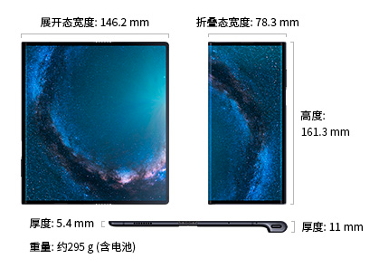

# 「有生之年」手机

周一早上，到处是关于 HUAWEI Mate X 的消息。如果不是股市开市后一路上扬，这话题可以唠一整天。

  
from huawei.com

非对称的设计——不知该怎么形容，姑且称之为书脊式——，不知是否参考了 Kindle Oasis 的样式。不过，早在 Ascend P1 型号中，华为就曾使用过类似的设计，也算独树一帜。反正，当时我就很喜欢，现在依然很喜欢。

  

原先对于柔性屏没什么兴趣，但是 Mate X 改变了我的想法。一个实用的折叠屏手机应该是什么样子的？看到之前，我想象不出她的模样；目睹之后，便觉得她就应该是这样的。我对她的外表如此钟情，以至于忽略了她 5G 的芯——也许这才是 Mate X 真正的内涵。 

  
HUAWEI Mate X 三视图  
from huawei.com

中午，OPPO 副总裁沈义人在微博上展示了一款未知型号的折叠屏手机，外观与 Mate X 颇有几分形似，有点不甘示弱的意思。古人云，出道有先后。只能说，英雄所见略同。

  
from weibo.com

Mate X 在欧洲定价 €2299，折合人民币约￥17000。而且，还得等。

这个价格彰显了华为官方对于这款产品的自信。毕竟，在 Motorola 3200，也就是俗称的大哥大退隐江湖之后，还没有哪一款主流手机敢卖这么高的价格。

  
*图中手机的型号不详，有说是行动电话的鼻祖 DynaTAC 8000X，但我觉得这俊秀的外形更像是后期型号。总之系出同门，Motoralo 3200 的样子与此相近。在上世纪九十年代中期，一部大哥大的价格可以抵一套房，而且有钱也未必能买到。*  
（图片源于网络）

可以参照的是，在曾任奢侈品牌巴宝莉 CEO 的时尚达人 Angela Ahrendts 操刀之下，iPhone 的价格一路走高，到 iPhone Xs Max 也才刚刚突破万元大关。尽管背后的 iOS 及其生态依然如日中天，然而对于如此高昂的价格，消费者已然不买账了。美丽动人的 Ahrendts 姐姐不得不为此背锅，黯然下课。

  
from cnet.com

所以，Mate X 的这个价格到底是不是认真的？还有待观察。但在这个周一，鲜有人吐槽 Mate X 的定价，大家更关心膜应该怎么贴。也许是被她的魅力所折服吧，也可能是因为根本不敢高攀。

我的师兄H先生极其反感双屏手机，不怎么掺合热点的他，先是前几天激烈批判了 Galaxy Fold，今天又接力吐槽了 Mate X，每条朋友圈都写了满满一屏。希望他看到这篇东西，不要生气，毕竟我们只是意见分歧，并非主义之争。

  
Samsung Galaxy Fold  
from wamsung.com

不过，无论是前后双屏，还是超大方屏，目前的应用支持的确都还相当匮乏。习惯了挤在一居室的逼仄的公寓里，突然说隔壁的房间也能用，大家错愕之余，一时还没想好该怎么嗨。

还有就是，柔性屏的代价依然有点高，只能搭载在昂贵的高端机型上。我有点担心很多囊中羞涩的开发者买不起测试机，索性放弃了。什么时候折叠屏的附身，不止可以选择让屏幕放大一倍，也能够选择让手机缩小一半，这项技术才算是真正白菜化了。

不过，作为厂商展示硬实力的方式，Mate X 这场硬朗的秀，相当成功。至少我以为，无论内涵还是外表，都力压婉约派的 Galaxy Fold 一筹，而 iPhone 难得在场下做了一回看客。无论是作为中国人，作为消费者，还是作为正在发奋图强的华为员工的前同事的同事，我都感到相当自豪。

也许是受到了除了屏幕还是屏幕的 Mate X 的刺激，有人萌生了不一样的念头：
> 希望有生之年能看到一部没有背面，没有侧面，没有前置摄像头，没有任何插孔的手机吧。  
> ——帅帅的斌仔

我猜，斌仔想要的可能是这个：

*照片下方的文字显示：中国士兵正在摆弄缴获的美制 BC-11F 无线电收发机。*
（图片源自维基百科）

这款八十年前的前卫设备，由 Galvin Manufacturing Corp. 出品，也就是后来鼎鼎大名的 Motorola, Inc.。不得不说，虽然如今手机界几乎已经遗忘了摩托罗拉的存在，你大爷毕竟是你大爷。

维基百科上介绍说：
> The SCR-536, which incorporated five vacuum tubes in a waterproof case, had no separate power switch. Instead the radio turned on when the antenna was pulled out, and off when it was retracted.  
> https://en.wikipedia.org/wiki/SCR-536

你看，这玩意儿连开关都不用，简直屌爆了！

