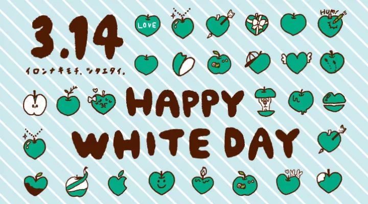
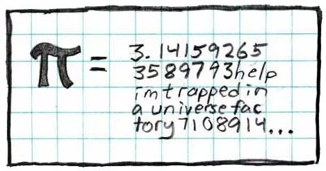
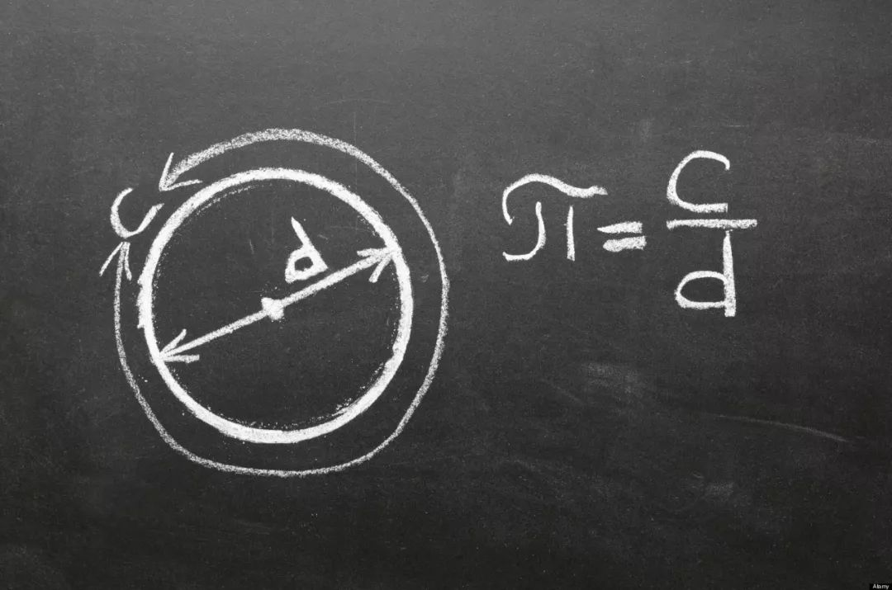
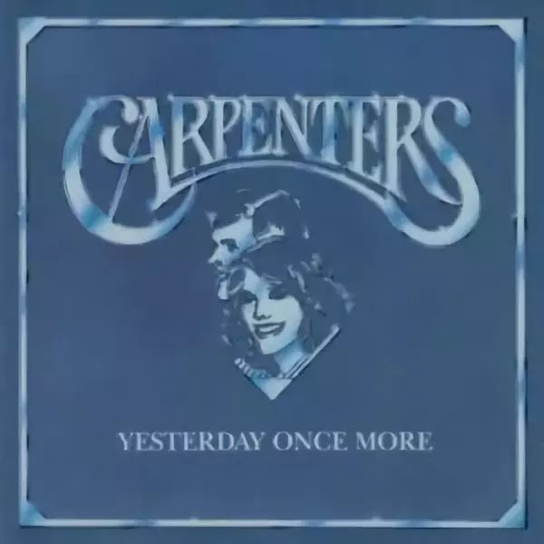
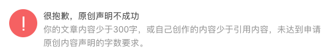

# Today is March 14th, 2019

+ Today is Mar 14th, 2019

* It is not single
* It is not couple
* It is no 3 no 4
* It is 3.14
* Today is White Day [1]
* A day for lovers who shine each other
* White will darken, so does love

  
from forus.co.jp

* It is not 3
* It is not 4
* It is not 3.14
* It is 3.14159 26535 ...
* Today is π Day
* A day for friends who hate each other
* π will not end, nor does life

  
from xkcd.com

* It is not α [2]
* It is not β [3]
* It will not change any more
* It is constant π
* The starting point is also the ending point
* He missed himself forever
* When the circle was straighten

  

* It is not 09:00am
* It is not 12:00pm
* It is not 18:00
* It is 12:00am, Mar 15th, 2019
* Today was yesterday
* Yesterday Once More
* Yesterday no more

  
from wikipedia.org

This blog was written in Chinglish. It is my native language. You are able to understand every word, every phrase and every sentence, aren't you? Congratulations! U R OK! And your English is as bad as mine!

[1] Valentine's Day in countries which observe White Day is typically observed by girls and women presenting chocolate gifts (either store-bought or handmade), usually to boys or men, as an expression of love, courtesy, or social obligation.  
https://en.wikipedia.org/wiki/White_Day

[2] An early version of a program or application, typically unstable, but useful to show what the product will do.  
https://en.wiktionary.org/wiki/alpha_version

[3] An early version of a program or application that contains most of the major features, but is not yet complete.  
https://en.wiktionary.org/wiki/beta_version

----

说一段故事。

南北朝时期的时尚杂志《世说新语》里这么一段记载：“文帝尝令东阿王七步中作诗，不成者行大法，应声便为诗……帝深有惭色。”

文帝就是曹操的嫡长子，魏文帝曹丕。东阿王就是曹植，字子建，魏明帝时曾徙封东阿，故也称东阿王。行大法么，就是砍头的意思。曹丕看曹植不顺眼，就找碴嘛。借口说朝野谣传曹植的文章都是抄的，不是原创的！为正视听，一定要曹植当场露一手，不然就要扣他个沽名钓誉、欺君罔上的帽子，拖出去喀嚓。

据史料记载，曹操有十几个老婆，生了几十个孩子。虽说手足情深，然而这几十号乌泱乌泱跟八爪鱼似的，兄弟姐妹之间感情疏离，也是情有可缘。但是曹丕和曹植又不一样，他俩是一个妈生的，曹丕是老大，曹植是老三。

>   曹植：这我丕哥 __@曹丕__  
>   曹丕：这我贱弟 __@曹植Super子建__  
>   *不存在的微博*

他们的爸爸虽然死了，可他们的妈妈卞夫人还活着。就这样迫不及待地对自己的同胞兄弟下手，曹丕真不愧是寡人！

>   天下才有一石，曹子建独占八斗。  
>   *东晋·谢灵运*

这种刁难还真拿不下曹植。没走几步，这首千古流传的佳作脱口而出了：

>   煮豆燃豆萁，豆在釜中泣。  
>   本是同根生，相煎何太急？  
>   *魏·曹植*

《世说新语》上说，“帝深有惭色”。这个结尾其实相当可疑。

魏蜀吴的二代中，曹丕算是最厉害的角色。只是政治手腕不及乃父，诗词歌赋不及乃弟，所以他的光芒被掩盖了。反过来讲，曹丕的文采高于曹操，而政治远胜曹植，这么一位文体两开花的跨界高手，是这么好相与的么？会被这区区二十个字怼得脸红？我还真不太相信。

有没有可能，曹丕的反唇相讥，让曹植下不了台？果如是，那么所谓“帝深有惭色”，应是“弟深有惭色”之谬，这场交锋曹丕占了上风，所以才没有恼羞成怒，而曹植虽然得以苟全性命，政治生涯却已完结，从此郁郁而终。这是曹植的不幸，却是文坛之幸，否则也就没有《洛神赋》了。

曹丕到底说了什么？你看下面这话像不像？  

我为什么要画蛇添足，扯上这么这一段陈年旧事？上面就是原因！

[版权声明](../../LICENSE/zh_cn.md) | [LICENSE](../../LICENSE/en_us.md)